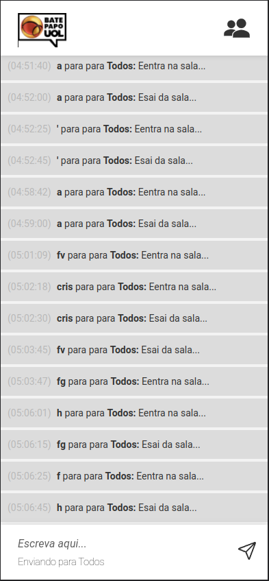
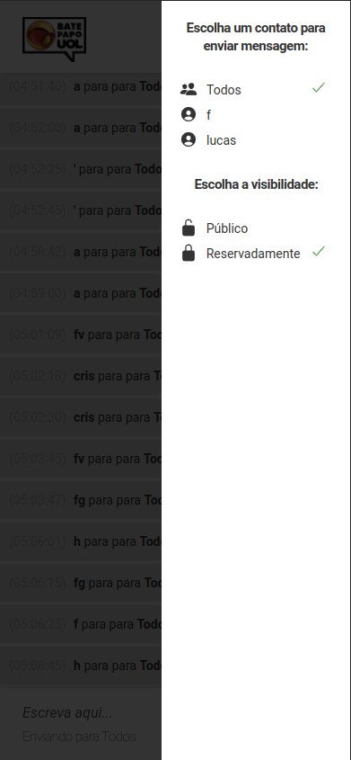

### Bate-Papo UOL
Terceiro projeto com JavaScript é a implementação de um bate-papo totalmente funcional, inspirado no saudoso Bate-Papo UOL. Mas não foi usado o site real da UOL como referência, pois apesar de inspirado nele, essa interface é totalmente diferente 

   |   |   |   

### Como rodar o projeto na sua máquina
- Clone esse repositório